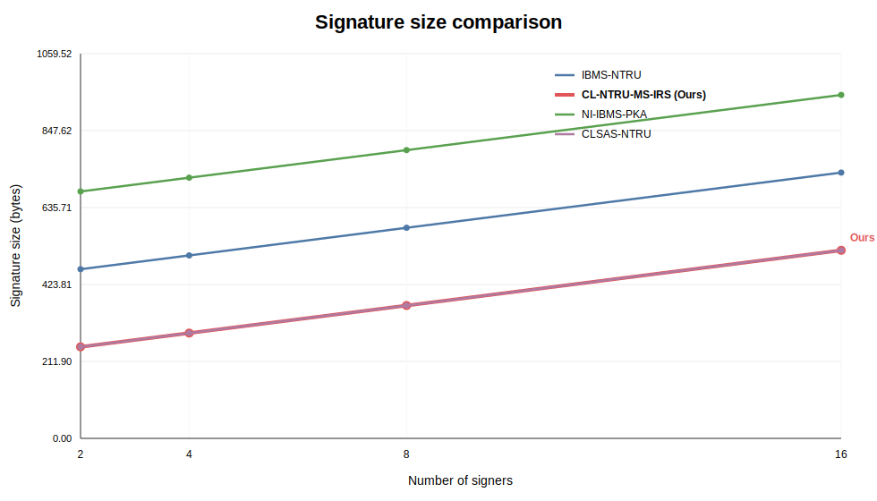
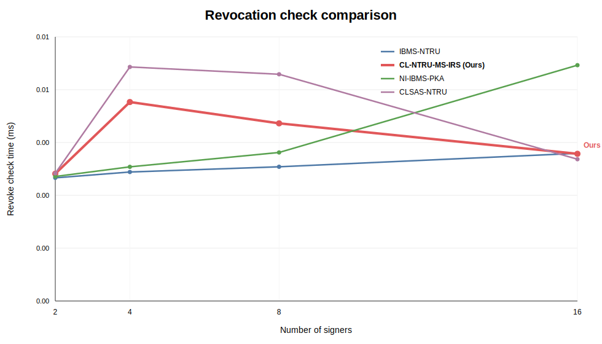
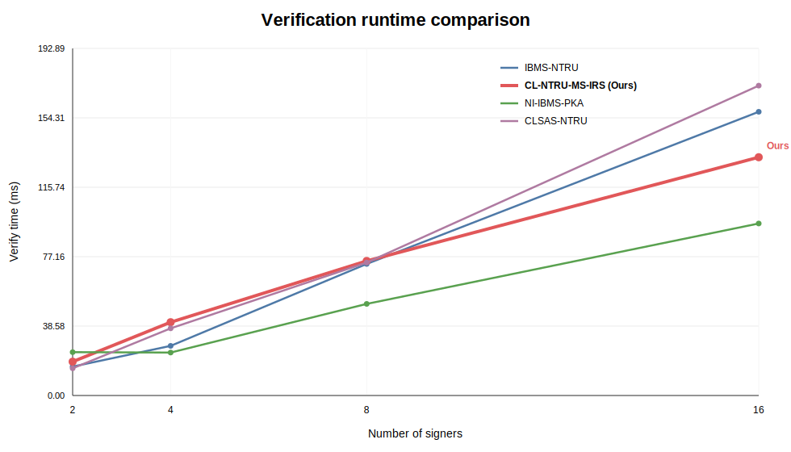

# Comparative Evaluation Report

## 核心结论（突出签名压缩 + 撤销效率）
- 本报告重点比较签名长度压缩效果与撤销处理效率。

## Table 1. 签名大小与压缩率（n=107, q=2048, 8 signers）

| Scheme | Signature Size (B) | Size Reduction vs Max |
|---|---:|---:|
| CLSAS-NTRU | 366 | 63.69% |
| IBMS-NTRU | 580 | 42.46% |
| NI-IBMS-PKA | 794 | 21.23% |
| CL-NTRU-MS-IRS | 1008 | 0.00% |

## Table 2. 撤销效率（n=107, q=2048, 8 signers）

| Scheme | Revoke Update (ms) | Revoke Check (ms) | Verify (ms) |
|---|---:|---:|---:|
| CLSAS-NTRU | 0.0006 | 0.0019 | 46.961 |
| IBMS-NTRU | 0.0004 | 0.0019 | 47.264 |
| CL-NTRU-MS-IRS | 0.0004 | 0.0020 | 72.218 |
| NI-IBMS-PKA | 0.0004 | 0.0034 | 34.898 |

## Figures

