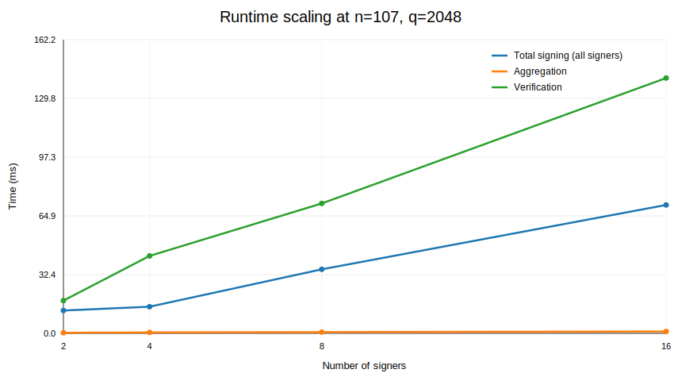
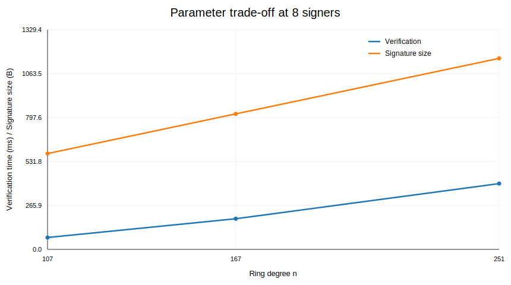

# Evaluation Report (journal-style)

## Experimental protocol
- Environment: Python reference implementation in this repository.
- Metrics: key extraction, partial signing, aggregation, verification, signature size.
- Each setting is averaged over 20 rounds.

## Table 1. Runtime scaling (n=107, q=2048)

| #Signers | KeyExtract (ms) | PartialSign (ms/signer) | Aggregate (ms) | Verify (ms) | Verify Success | Signature Size (B) |
|---:|---:|---:|---:|---:|---:|---:|
| 2 | 9.282±15.879 | 6.307±16.190 | 0.346±0.418 | 18.086±3.659 | 1.00 | 466 |
| 4 | 7.907±10.625 | 3.684±0.791 | 0.527±0.444 | 42.770±31.600 | 1.00 | 504 |
| 8 | 7.511±8.999 | 4.424±6.844 | 0.701±0.309 | 71.752±35.831 | 1.00 | 580 |
| 16 | 7.927±9.262 | 4.434±7.897 | 1.065±0.379 | 141.047±46.463 | 1.00 | 732 |

## Table 2. Parameter sensitivity (8 signers)

| n | q | Verify (ms) | Signature Size (B) |
|---:|---:|---:|---:|
| 107 | 2048 | 71.752±35.831 | 580 |
| 167 | 2048 | 185.292±48.721 | 820 |
| 251 | 2048 | 398.151±57.477 | 1156 |

## Figures

## Notes
- This benchmark is intended for reproducible engineering comparison in your own environment.
- For strict cryptographic security claims, map parameters to standardized security levels before publication.